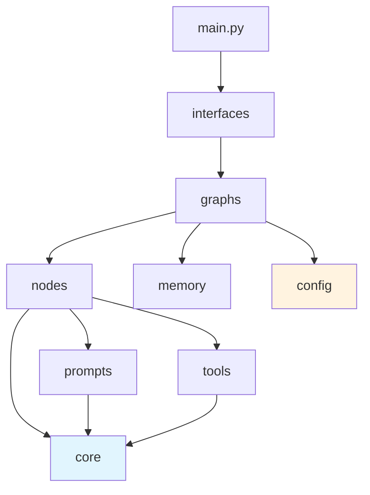
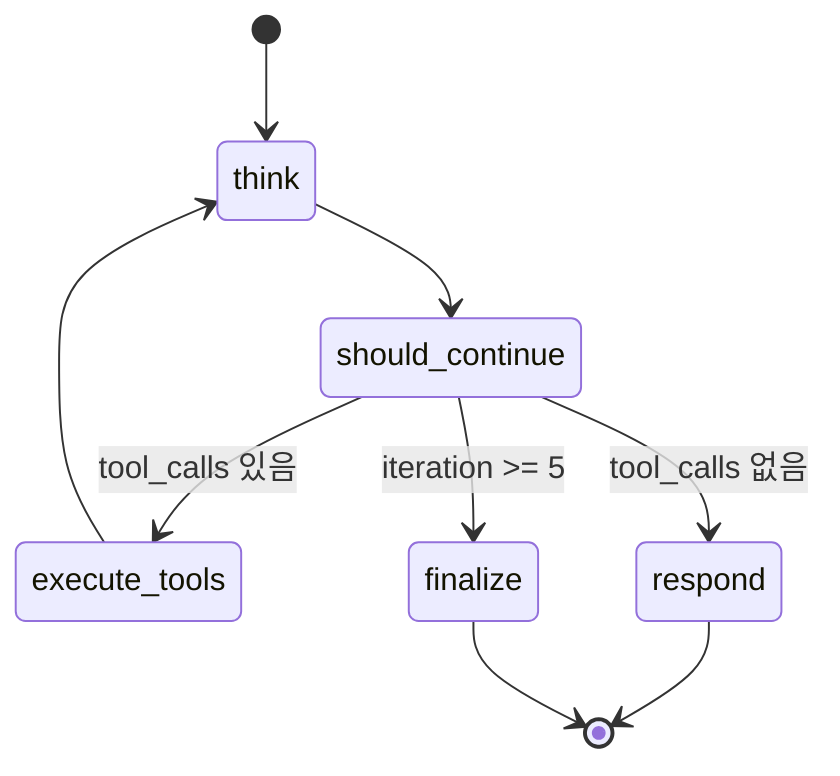
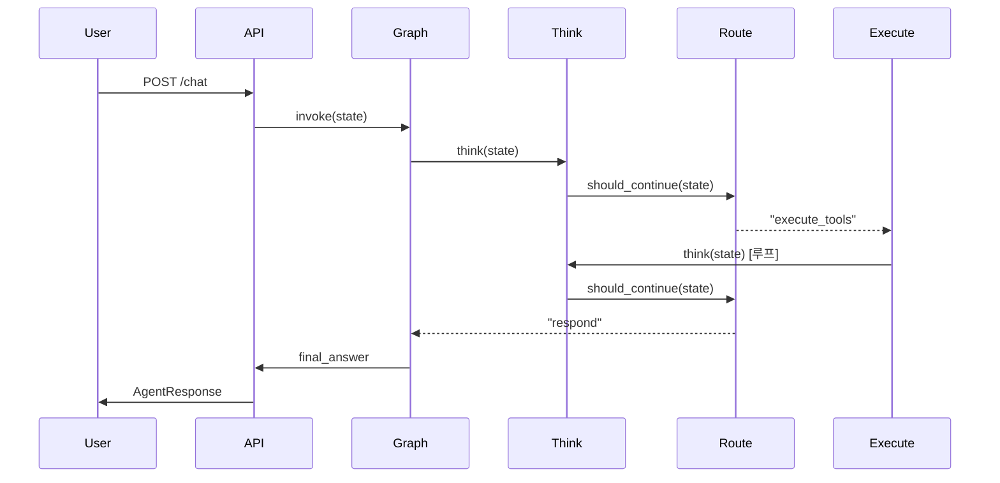

# 06 — 문서 생성

> 작업 전 `assets/architecture-rules.md`를 먼저 읽는다.

---

## README.md 템플릿

```markdown
# [프로젝트명]

> LangGraph 7-레이어 아키텍처 기반 에이전트 시스템

## 구조

\`\`\`
src/
├── core/          # State, Schema, Model Factory
├── prompts/       # 프롬프트 템플릿, 동적 빌더
├── tools/         # 도구 레지스트리, 개별 도구
├── nodes/         # 추론, 실행, 라우팅 노드
├── graphs/        # 메인 그래프, 서브그래프
[Phase 3 추가]
├── memory/        # 체크포인터, 저장소
├── interfaces/    # REST API, 스트리밍
├── config/        # 환경 설정, 에이전트 구성
└── main.py        # 진입점
\`\`\`

## Phase 상태

현재: **Phase [N]**

| Phase | 상태 | 설명 |
|-------|------|------|
| 1 | [완료/진행중] | 최소 구조 (core, prompts, tools, nodes, graphs) |
| 2 | [완료/진행중/미시작] | 기능 확장 (Model Factory, 서브그래프) |
| 3 | [완료/진행중/미시작] | 프로덕션 (memory, interfaces, config) |

## 실행 방법

\`\`\`bash
# 로컬 실행
python main.py

# API 서버 (Phase 3)
uvicorn interfaces.api:app --host 0.0.0.0 --port 8000
\`\`\`

## 의존성 흐름

\`\`\`
main.py → interfaces/ → graphs/ → nodes/ → prompts/, tools/, core/
\`\`\`

## 등록된 도구

| 이름 | 파일 | 설명 |
|------|------|------|
| search | tools/search.py | 웹 검색 |
[추가 도구...]

## 서브그래프

| 이름 | 파일 | 역할 |
|------|------|------|
[서브그래프 목록...]
```

---

## Mermaid 다이어그램 패턴

### 의존성 Flowchart



### 실행 흐름 StateDiagram



### 데이터 흐름 SequenceDiagram



---

## Phase 자동 판별 로직

README 생성 시 현재 Phase를 자동으로 판별한다:

```python
from pathlib import Path

def detect_phase(project_root: str) -> int:
    """프로젝트의 현재 Phase를 파일 구조로 판별한다."""
    root = Path(project_root)

    has_config = (root / "config").is_dir()
    has_memory = (root / "memory").is_dir()
    has_interfaces = (root / "interfaces").is_dir()
    has_models = (root / "core" / "models.py").is_file()
    has_execution = (root / "nodes" / "execution.py").is_file()

    if has_config or has_memory or has_interfaces:
        return 3
    elif has_models or has_execution:
        return 2
    else:
        return 1
```

---

## 검증 체크리스트

- [ ] README에 현재 Phase가 정확히 표기되어 있는가
- [ ] 디렉토리 구조가 실제 파일과 일치하는가
- [ ] 등록된 도구 목록이 `TOOL_REGISTRY`와 일치하는가
- [ ] Mermaid 다이어그램이 실제 그래프 구조를 반영하는가
- [ ] 의존성 흐름 다이어그램이 아키텍처 규칙과 일치하는가
